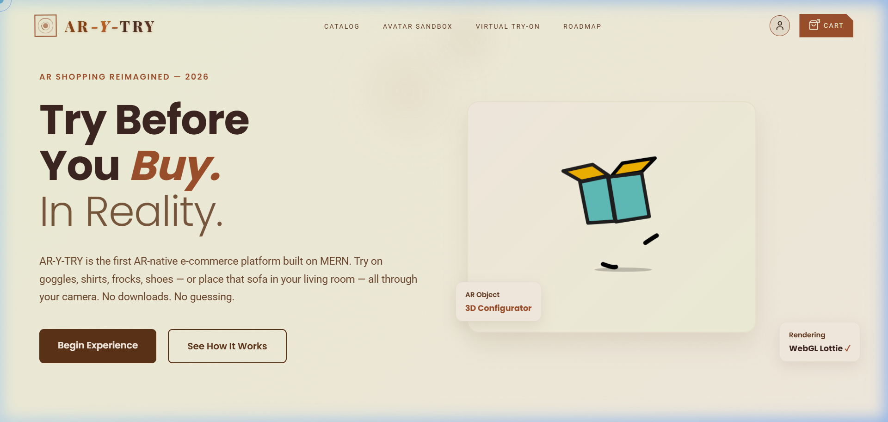
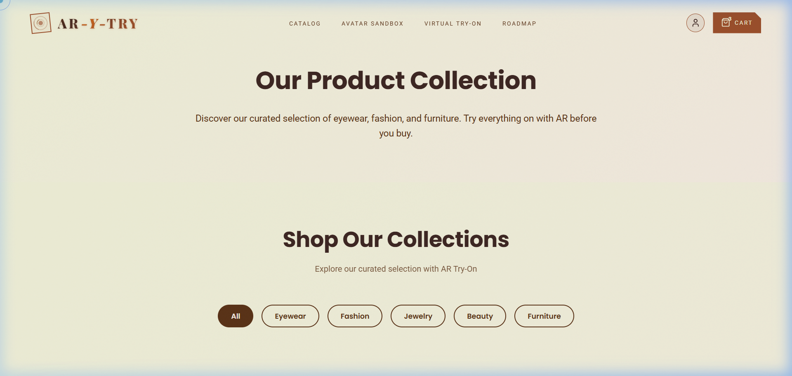
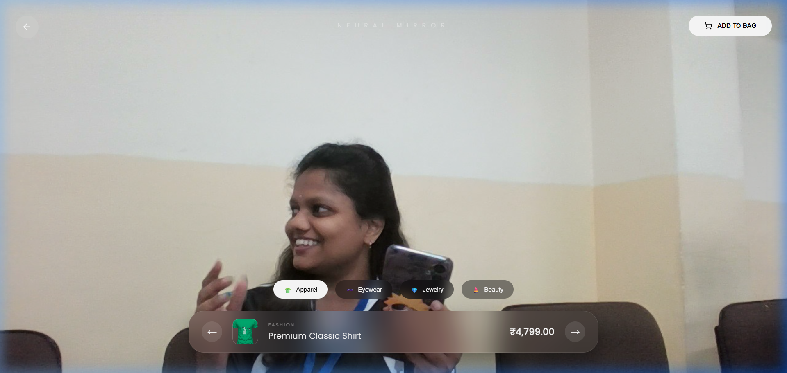
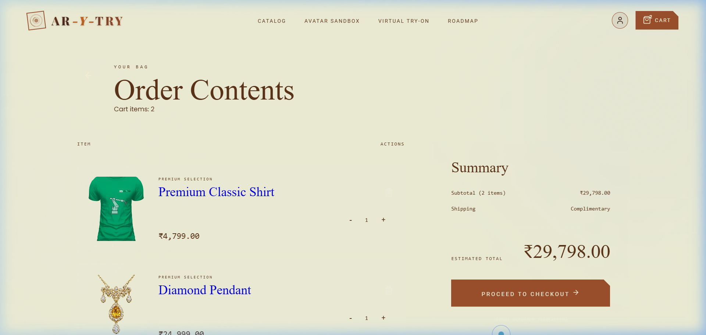

<div align="center">

# ✦ AR-Y-Try — Next-Gen Spatial E-Commerce


<br/>

**Redefining digital fashion through spatial computing, fluid aesthetics, and Generative AI.**

AR-Y-Try is an industry-grade, highly interactive "Cyber-Premium" e-commerce application. It seamlessly blends a robust, security-first Node.js backend with an immersive React 3D frontend experience, natively connected to a downloadable AI-powered Chrome Extension for Virtual Try-Ons.

[Explore Features](#-core-features) • [System Architecture](#-architecture) • [Getting Started](#-getting-started) • [Security](#-security-implementation)

</div>

---

## ✨ Core Features

### 🎨 The "Cyber-Premium" Experience
Engineered for aesthetic dominance. The platform features strict use of **Glassmorphism**, fluid motion dynamics, micro-interactions, custom interactive cursors, and custom color tokenization (`--gold`, `--ink`, `--cream`) heavily influenced by cutting-edge spatial design.

### 👗 FitAI — Virtual Try-On Extension
The ecosystem includes a securely compiled **Google Gemini 2.0 Flash** Chrome Extension.
- **Distributable Asset:** Authenticated users can auto-download the `.zip` directly from the navigation bar.
- **Pre-Configured Architecture:** The extension is heavily integrated with the platform, requiring zero developer configuration for end-users. 
- **Generative AI Styling:** Replaces, generates, and maps any catalog clothing directly onto the user's uploaded Model Photo via complex prompt conditioning.

### 🕹️ 3D Avatar Sandbox / AR
A dedicated `/sandbox` environment enabling users to customize geometry, accessories, and dimensional elements interactively before adding them to their cart, bridging the gap between digital ownership and physical retail.

### 🛒 End-to-End E-Commerce Flow
- State-driven seamless cart architecture powered by **Redux Toolkit**.
- Automated stock synchronization and inventory mapping.
- Immersive product discovery details dynamically mapped to the database.

---

## 📸 Screenshots

<div align="center">

### 🏠 Home Page


### 🛍️ Product Catalog


### 🕶️ Virtual Try-On (AR)


### 🛒 Shopping Cart


</div>

---

## 🏗️ Architecture

ARYĀ operates in a decoupled monorepo structure.

```text
ar-ecommerce/
├── 📁 client/                # React, Vite, Redux. Core frontend interface.
│   ├── src/components/       # Reusable abstracted UI logic
│   ├── src/pages/            # Complex routed boundaries
│   ├── src/store/            # Global Redux state slices
│   └── public/               # Static assets & Distributable extensions
│
├── 📁 server/                # Node.js, Express, MongoDB. Primary API Engine.
│   ├── controllers/          # Business logic executing operations
│   ├── middleware/           # RBAC Authentication & Security walls
│   ├── models/               # Mongoose DB schemas with automated hooks
│   └── routes/               # API endpoint orchestration
│
└── 📁 tryon-extension/       # Chrome Browser Extension Source Code
    ├── background.js         # Service Worker orchestrating Gemini API calls
    ├── content.js            # UI DOM overrides & overlay logic
    └── pages/                # Chrome Options & Settings UI
```

---

## 🔒 Security Implementation

Enterprise-grade security standards are prioritized deeply into the architecture:

1. **HTTP-Only Cookie Strategy**: Transitioned out of inherently vulnerable `localStorage` into protected, server-signed HTTP-Only browser cookies for JWT transmission to heavily mitigate XSS attacks.
2. **Robust RBAC (Role-Based Access Control)**: Enforced backend middleware validating payload privileges (`User`, `Admin`, `Business`) before execution.
3. **Mongoose Hooks**: Encryption hashing is managed autonomously at the data-mapping level before saving payloads to the database clusters.

---

## 🚀 Getting Started

### Prerequisites
- [Node.js](https://nodejs.org/en/) v18.0.0 or higher
- [MongoDB](https://www.mongodb.com/) instance (Local or Atlas)
- NPM or Yarn package managers

### 1. Backend Initialization

```bash
# Navigate to the server
cd server

# Install dependencies
npm install

# Configure your environment
# Create a .env file locally with your MONGO_URI and JWT_SECRET

# Start the server (Runs on Port 5000)
npm run dev
```

### 2. Frontend Initialization

```bash
# Navigate to the client 
cd client

# Install dependencies
npm install

# Start the Vite React Engine (Runs on Port 5173)
npm run dev
```

### 3. Extension Setup (User View)
1. Navigate to the web application at `http://localhost:5173`.
2. Ensure you are **logged in** to trigger the authentication UI flow.
3. Click the **"Add Extension ✦"** button in the global navigation bar.
4. Extract the cleanly formatted `FitAI-Extension.zip`.
5. Navigate to `chrome://extensions`, enable **Developer Mode**, and click **Load Unpacked**.
6. Select your extracted folder! You can now right-click any image across the web to initiate styling operations.

---

## 🔮 Future Roadmap

- [ ] **WebXR Integration**: Transition absolute viewport mappings directly into WebXR rendering spaces.
- [ ] **Microservices Expansion**: Extract the Auth layer into an isolated service cluster.
- [ ] **Headless CMS integration**: Map dynamically built content via a separate headless interface.

---

<div align="center">
  <p>Built with precision and spatial awareness.</p>
</div>
